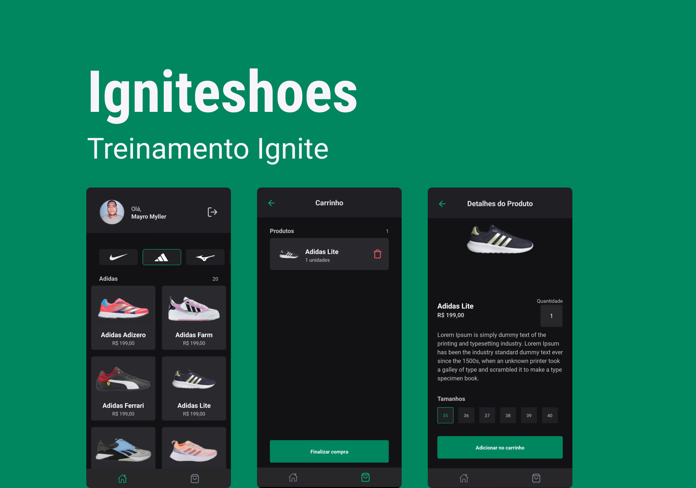

# Ignite Shoes



App no estilo e-commerce, voltando para modelos de tenis. Você pode: filtrar por marcas, selecionar os tamanhos e quantidade, e por fim verificar os itens no carrinho.

### 📋 Pré-requisitos

Certifique-se que tenha todo o [ambiente de desenvolvimento](https://react-native.rocketseat.dev) preparado para iniciar/rodar um projeto em React Native, de acordo com seu sistema operacional: Windows, Linux, MacOS, etc. Com emuladores e/ou dispositivos devidamente configurados. Este projeto também utiliza o [Expo](https://expo.dev).

### 🔧 Instalação

Clonando este repositório:

```
git clone git@github.com:mayromyller/igniteshoes.git
```

Instalando dependencias (yarn ou npm):

```
yarn install
```

Rodando o projeto (yarn ou npm):

```
npx expo start --dev-client
```

Encontrou algum problema ao rodar o app? Fique a vontade para me contactar no [Linkedin - Mayro Myller](https://www.linkedin.com/in/mayromyller/)

## 🛠️ Construído com

- Typescript | Javascript - React Native
- [Expo/Expo CLI](https://expo.dev), Expo dev client, EAS
- [Firebase Cloud Message](https://firebase.google.com)
- [OneSignal](https://onesignal.com/) - Push notification
- [Expo Linking](https://docs.expo.dev/versions/latest/sdk/linking/)
- [React Navigation](https://reactnavigation.org) - Bottom tab & Stack Navigation
- [NativeBase](https://nativebase.io/) (Estilização/CSS)

## 📌 Versão

Version: 1.0.0

## 📄 Licença

Este projeto está sob a licença (sua licença) - veja o arquivo [LICENSE.md](https://github.com/usuario/projeto/licenca) para detalhes.
